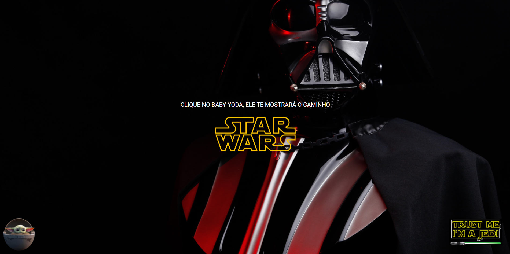

<h1 align="center"> StarWars Fansite</h1>

Projeto desenvolvido durante o Hiring coders da VTEX com Gama Academy

📖 - Projeto de fã para homenagiar a franquia StarWars, criada pelo cineasta George Lucas, que conta com uma série de nove filmes de fantasia científica e dois spin-offs.

<h2>🚀 Tecnologias utilizadas: </h2>

- HTML
- CSS
- JavaScript
- NodeJS
- SCSS

<h2>Para iniciar o projeto use: </h2>
git clone https://github.com/olucasklein/gama-starwars.git

<h2>Para instalar as dependências use:</h2>
npm install

<h2>Para iniciar em modo de desenvolvimento use:</h2>
npm start

<h2>Aconselhado ter instalado NODEJS versão 14.x em diante.</h2>

Para instalar o node [clique aqui](https://nodejs.org/en/)

<h2>📝 Licença</h2>
Esse projeto está sob a licença MIT. Veja o arquivo LICENSE para mais detalhes.
